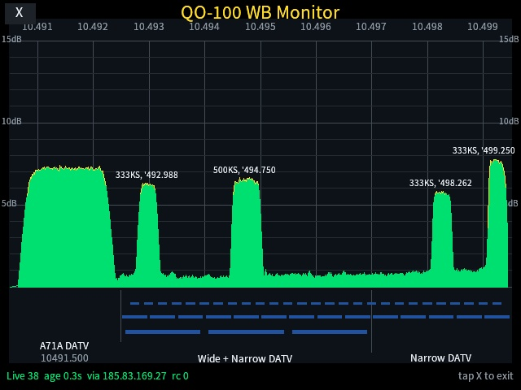

# QO-100 WB Monitor for MaixCAM2



`QO-100 WB Monitor` is a MaixPy application that turns a MaixCAM2 into a small live wideband spectrum display for the QO-100 / Es'hail-2 DATV transponder.

The app opens the same BATC wideband FFT feed used by <https://eshail.batc.org.uk/wb/>, decodes the binary WebSocket spectrum frames, and draws the 10.4905 to 10.4995 GHz wideband view directly on the MaixCAM2 screen. It shows the A71A beacon area, DATV channel markers, a live spectrum trace, detected signal labels, and connection status.

## Features

- Starts immediately into the live spectrum view.
- Uses BATC's `wss://eshail.batc.org.uk/wb/fft` FFT feed.
- Falls back to BATC's current IP address if local DNS is broken, while keeping TLS SNI and the HTTP `Host` header set to `eshail.batc.org.uk`.
- Validates the WebSocket handshake, loads the system CA bundle explicitly on MaixPy, replies to server pings, and reconnects with backoff if the feed drops.
- Shows the active connection source and reconnect count in the status line.
- Draws the QO-100 wideband scale, beacon marker, DATV channel markers, live spectrum, and simple signal bandwidth/frequency labels.
- Runs without third-party Python packages on MaixPy.

## Install

Build the app package:

```sh
./scripts/package.sh
```

Install it on a MaixCAM2 with SSH enabled:

```sh
./scripts/deploy.sh root@<camera-host>
```

The package is installed through `app_store_cli` and appears in the MaixCAM launcher as `QO-100 WB Monitor`.

## Use

1. Make sure the MaixCAM2 has internet access.
2. Start `QO-100 WB Monitor` from the launcher.
3. The display connects to the BATC QO-100 wideband FFT feed and starts drawing the live spectrum.
4. Tap the `X` button in the top-left corner to exit.

If the camera can reach the internet but cannot resolve DNS names, configure working DNS servers on the camera. The app includes a fallback IP for BATC, but fixing DNS is still recommended for normal MaixCAM networking.

One working `systemd-resolved` configuration is:

```sh
mkdir -p /etc/systemd/resolved.conf.d
cat >/etc/systemd/resolved.conf.d/qo100-wb-mon.conf <<'EOF'
[Resolve]
DNS=1.1.1.1 8.8.8.8 9.9.9.9
FallbackDNS=1.0.0.1 8.8.4.4
Domains=~.
EOF
systemctl restart systemd-resolved
getent hosts eshail.batc.org.uk
```

The same fix can be applied from the development computer:

```sh
./scripts/fix_dns.sh root@<camera-host>
```

## Connection Settings

The default feed settings should normally be left unchanged. For testing or a local relay, these environment variables are available:

- `QO100_WB_HOST`: WebSocket host name, default `eshail.batc.org.uk`.
- `QO100_WB_PATH`: WebSocket path, default `/wb/fft`.
- `QO100_WB_PROTOCOL`: WebSocket subprotocol, default `fft`.
- `QO100_WB_FALLBACK_IPS`: comma-separated fallback IPs, default `185.83.169.27`.

## Development Test

For a one-shot remote screenshot during development, run the app with:

```sh
QO100_WB_SCREENSHOT=/tmp/qo100_wb_mon.jpg QO100_WB_SCREENSHOT_AFTER=10 python3 main.py
```

The saved image is the exact frame drawn by the MaixPy renderer after the requested delay.

To run the installed app remotely, wait 10 seconds, and pull the screenshot into the README image path:

```sh
./scripts/test_remote.sh root@<camera-host>
```
